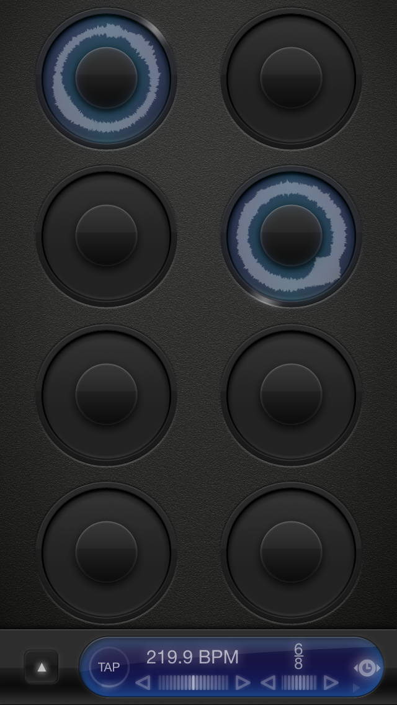

# MashupBot

### Background

Loopy is an IPhone app that offers an intuitive and fun way to layer
musical ideas into little performance pieces. My idea is to recreate Loopy,
but with premade loops of other songs, letting the user switch between
different loops. In effect, these are mashups that the user can make
on the spot.

### Functionality and MVP

- [ ] Pause/play different loops on the loop grid
- [ ] Switch between different loops
- [ ] Loops are color coded
- [ ] A progress bar on each loop rotates around the circle to indicate progress on a given loop
- [ ] Volume control

### Wireframes

### Architecture and Technologies
This project will be implemented with these technologies:

* Vanilla js
* The BonsaiJS graphics library
* The Howler.js sound library
* React for organizing the view layer hierarchy of elements
* Webpack to bundle and serve all the scripts

### Implementation Timeline

#### Day 1
#### Day 2

### Bonus Features
- [ ] Record your mashups
- [ ] Share mashups with friends
- [ ] Change tempo
